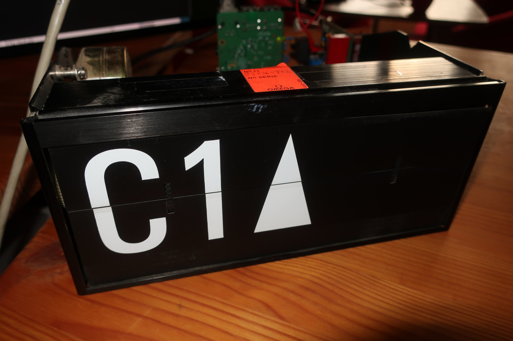
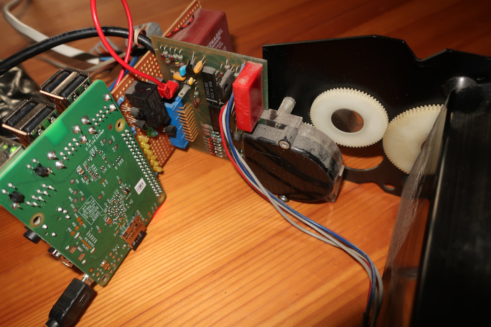
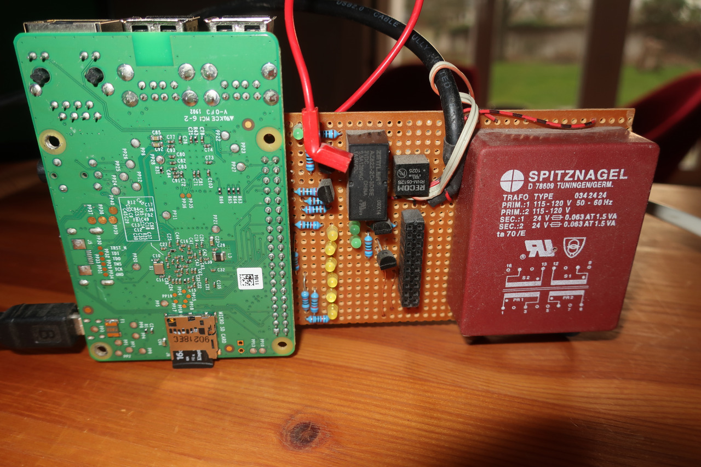

# Control of Split-Flap Display OM 3021



This is a small program to control a split flip display (type OM 3021) with a raspberry pi (B+). You can find some rough overview of the required hardware at the schematics supplied in [doc](doc/) folder.

## hardware

There is now way to control these displays without additional hardware. You need at least some 48V supply for the display motor and you need some [connection (board)](doc/Schematics.png) between the rapsberry pi and the display as well. The rest is all about the timing of the control.





<br clear="left"/>

## build program

The program requires the [WiringPi](https://github.com/WiringPi/WiringPi) library to work. Just install it as described there.

```bash
 git clone https://github.com/WiringPi/WiringPi.git
 cd WiringPi/
 ./build debian
 mv debian-template/wiringpi-3.0.deb .
 sudo apt install ./wiringpi_3.0.deb
 cd ..
```

If you have successfully installed WiringPi on your raspberry pi, you can donwload and compile this clock program.

```bash
 wget https://raw.githubusercontent.com/absorb-it/split-flap/main/clock.c
 gcc -o clock clock.c -l wiringPi
```

You should get some program named clock, which you can use to control your split flip display (if you have connected the display the right way to your raspberry pi).

## usage

You can see some usage example in the [uploaded video](video/flipclock_full.mp4). The program will understand some positional argument as well as some time (seprated with space) as an argument.

```bash
 ./clock 22     # positional argument given, must be between 0 and 62
 ./clock 13 45 	# will be read as hours minutes and converted into position
```

It's a prototype implementation, but maybe helpful to somebody. Works for me! :)
